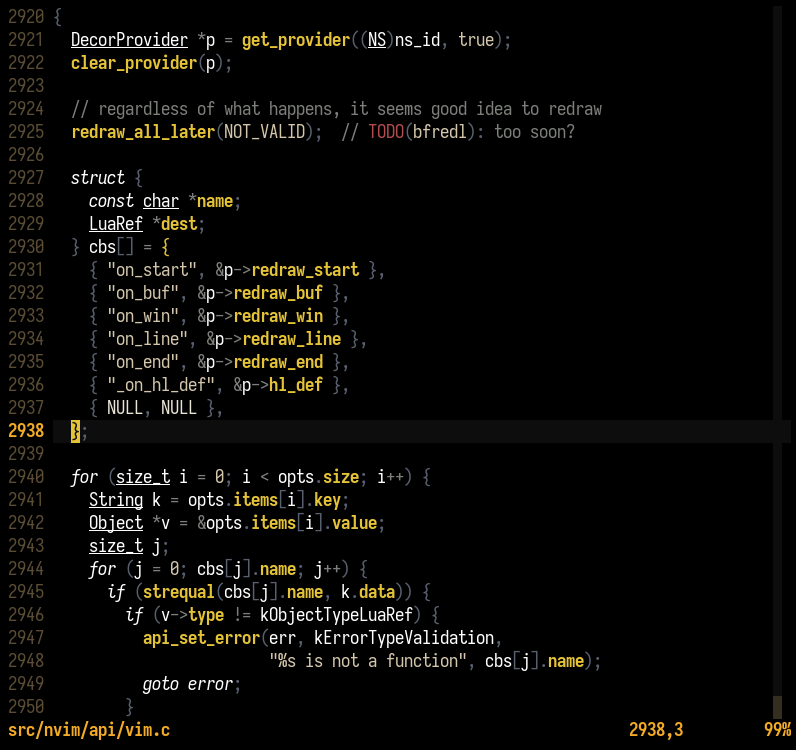
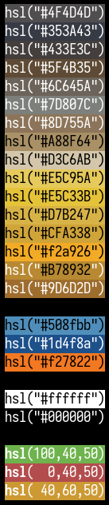

# kurzzug

A BVG-inspired vim colorscheme created with [Lush](https://github.com/rktjmp/lush.nvim).


## Screenshots





## Installation

```
TODO
```

## Usage

Having `kurzzug.vim` in `.../[n]vim/colors` you can simply add `colorscheme
kurzzug` to your `init.vim` / `.vimrc`.

If you are using Lush, then you could also simply have `kurzzug.lua` in
`.../nvim/lua/` let the following Lua-code run on nvim startup,
(e.g. by having it in a `lua << EOF` block in your `init.vim`):

```lua
local lush = require('lush')
local parsed = require('kurzzug')
local compiled = lush.compile(parsed, {force_clean = true })
lush.apply(compiled)
```
